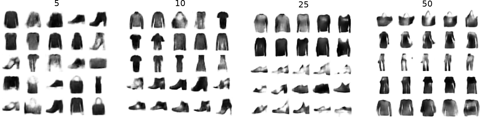

<div align="center">
  
# CODINE: Copula Density Neural Estimator

[Nunzio A. Letizia](https://scholar.google.com/citations?user=v50jRAIAAAAJ&hl=en), [Nicola Novello](https://scholar.google.com/citations?user=4PPM0GkAAAAJ&hl=en), [Andrea M. Tonello](https://scholar.google.com/citations?user=qBiseEsAAAAJ&hl=en)<br />

</div>

Official repository of the paper "Copula Density Neural Estimation".

> CODINE is a neural copula density estimator that estimates any copula density by maximizing a variational lower bound on the $f$-divergence.

<div align="center">

[](https://github.com/nicolaNovello/CODINE-copula-estimator/blob/main/LICENSE)
[](https://hits.sh/github.com/nicolaNovello/CODINE-copula-estimator/)

</div>

---

# 📈 Important results from our paper

## Copula density estimation

The main purpose of CODINE is to estimate the copula density... 


## Mutual information estimation


## Data generation





---

# 💻 How to run the code

(see subfolders...)

---

## 🤓 General description

The paper presents a copula density estimation method, denoted as CODINE.
CODINE is a neural network trained to estimate the copula density (and thus the pdf) associated to any data. By design, it works with pseudo-observations (data in the uniform probability space). It can be used for:
- Density estimation
- Dependence measures
- Mutual information estimation
- Data generation
- More..

---

## 📝 References 

If you use the code for your research, please cite our paper:
```
@article{letizia2022copula,
  title={Copula density neural estimation},
  author={Letizia, Nunzio A and Tonello, Andrea M},
  journal={arXiv preprint arXiv:2211.15353},
  year={2022}
}
```
## 📋 Acknowledgments

The implementation is based on / inspired by:

- [https://github.com/tonellolab/fDIME](https://github.com/tonellolab/fDIME)

---

## 📧 Contact

[nunzio.letizia@aau.at](nunzio.letizia@aau.at)

[nicola.novello@aau.at](nicola.novello@aau.at)
